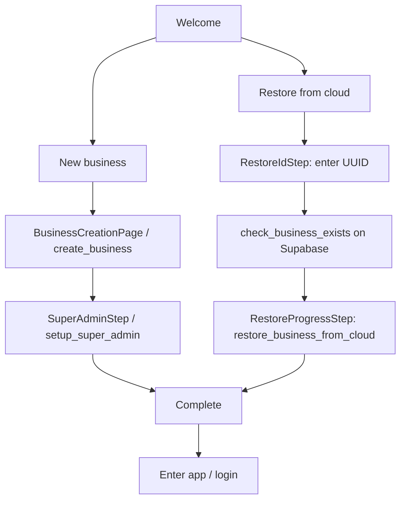

# Cloud sync and onboarding workflow

This document describes how **cloud sync** and **onboarding** work in this app, and **where the business ID comes from** when restoring existing data from Supabase.

---

## What is the business ID?

- The **business ID** is a **UUID** — the primary key of the `businesses` row (`businesses.id`).
- It is stored locally in `app_config` under the key `business_id`.
- The Rust `AppState` caches it in memory (`business_id: RwLock<Option<Uuid>>`) after DB connect or onboarding, via `load_business_id()`.
- Almost all replicated rows carry `business_id` (migrations + triggers ensure it stays consistent for sync).

---

## Onboarding — high-level flow

### Paths

| Path | Phase 1 | Phase 2 | `app_config` after finish |
|------|---------|---------|---------------------------|
| **New business** | `create_business` — generates a new UUID, inserts `businesses`, sets `business_id` | `setup_super_admin` — creates owner user; sets `super_admin_created` + `onboarding_complete` | `business_id`, `super_admin_created=true`, `onboarding_complete=true` |
| **Restore from cloud** | User enters **existing** business UUID | No separate super-admin step: pulled `users` include staff; `finalize_link` sets flags as if admin exists | Same final flags as above |

### Resume if the app closes mid-onboarding

- `check_onboarding_status` reads `app_config`.
- If `business_id` exists but `super_admin_created` is not `true`, the UI resumes at **Super Admin** (new-business path only).
- If `onboarding_complete` is `true`, onboarding is skipped and the user goes to login.

### Important: where does the restore business ID come from?

**It is not discovered automatically from Supabase Auth or the user’s email.** The restore flow expects the operator to **type the UUID** (the same ID shown after creating a business on another device — e.g. copy from **Complete** step).

1. **`RestoreIdStep`** (`src/features/onboarding/steps/RestoreIdStep.jsx`) collects the string and validates UUID format client-side.
2. **`check_business_exists`** (`onboarding::check_business_exists` in Rust) runs  
   `SELECT name FROM businesses WHERE id = $1` on the **Supabase Postgres** pool (requires Cloud Sync / `db_url` configured and reachable).
3. If a row exists, the user continues; **`RestoreProgressStep`** calls **`restore_business_from_cloud`** with that same `business_id`.

So: **business ID for restore = user-provided UUID**, verified to exist in cloud `businesses`, then used as the key for all subsequent pulls.

---

## Restore from cloud — backend steps

Function: `restore_business_from_cloud` in `src-tauri/src/commands/onboarding.rs`.

1. Parse `business_id_str` as `Uuid`.
2. **Business row:** `SELECT … FROM businesses WHERE id = $id` on cloud → UPSERT into local DB.
3. **Stores:** `SELECT … FROM stores WHERE business_id = $id` on cloud → UPSERT locally; collect `store_ids`.
4. **Store-scoped tables** (for those stores): `users`, `departments`, `categories`, `tax_categories`, `items`, `item_stock`, `customers`, `suppliers` — pulled with `WHERE store_id = ANY($store_ids)` → UPSERT locally.
5. **`finalize_link(local_pool, &id)`** writes:
   - `app_config.business_id` = that UUID  
   - `super_admin_created` = `true` (users came from cloud)  
   - `onboarding_complete` = `true`  
6. Logs `business_restored` to `sync_log`.

After a successful Tauri/HTTP RPC, the handler also calls **`state.load_business_id(&pool)`** so the sync workers see the cached business ID immediately.

**Prerequisites:** Supabase must be configured (cloud pool connected). Otherwise `check_business_exists` / `restore_business_from_cloud` fail with a “cloud not connected” style error.

---

## Cloud sync — how it works

Implemented mainly in `src-tauri/src/database/sync.rs` and configured via `src-tauri/src/commands/cloud_sync.rs` (settings persisted in `settings.json` as `supabase_config`: URL, anon key, **db_url** for server-side Postgres).

Two background loops run at startup (both poll every **5 seconds**):

### Push (local → Supabase)

- Reads **`sync_queue`** rows with `status = 'pending'`, scoped to the current **`business_id`** (from `AppState` or fallback `app_config`).
- Marks row `syncing`, replays INSERT/UPDATE to cloud, then `synced` or retry/`failed`.
- Rows get into `sync_queue` via **`queue_row`** after local writes (uses `business_id` on row JSON or falls back to `app_config`).
- **`backfill_sync_queue`** can enqueue existing local rows for the current business when sync is first enabled.

### Pull (Supabase → local)

- Uses a **cursor** stored in `app_config` (`cloud_pull_cursor`).
- For each table in `SYNC_TABLES`, fetches rows on cloud **newer than the cursor**, filtered by **`business_id`**.
- UPSERTs into local Postgres (idempotent).
- If there is no `business_id` yet (onboarding not finished), the pull cycle **skips**.

### When sync runs

- Requires **local DB connected**, **cloud pool** (or config to reconnect), and a **non-nil `business_id`** for push; pull also skips without `business_id`.
- Offline-first: if cloud is down, workers skip that cycle and retry later.

---

## Related code (quick map)

| Concern | Location |
|--------|----------|
| Onboarding RPCs + restore / check exists | `src-tauri/src/commands/onboarding.rs` |
| Onboarding UI flow | `src/features/onboarding/OnboardingFlow.jsx` |
| Restore UUID entry + verify | `src/features/onboarding/steps/RestoreIdStep.jsx` |
| Restore execution UI | `src/features/onboarding/steps/RestoreProgressStep.jsx` |
| Frontend RPC wrappers | `src/commands/onboarding.js` |
| Push/pull workers | `src-tauri/src/database/sync.rs` |
| Supabase config + status commands | `src-tauri/src/commands/cloud_sync.rs` |
| Cached `business_id` | `src-tauri/src/state.rs` (`get_business_id`, `load_business_id`) |

---

## Optional: `link_existing_business`

`ExistingBusinessStep` / `link_existing_business` is a **different** path: it expects the business to **already exist in the local database** (e.g. after data was pulled by other means). It does not pull from Supabase by itself; restore-from-cloud is the path that **downloads** data using the UUID you provide.
